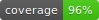
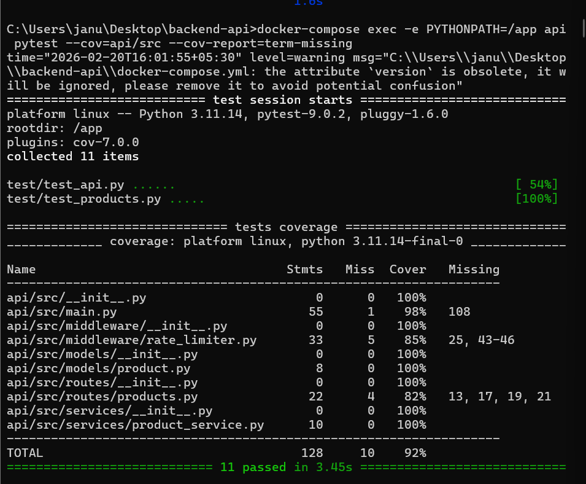
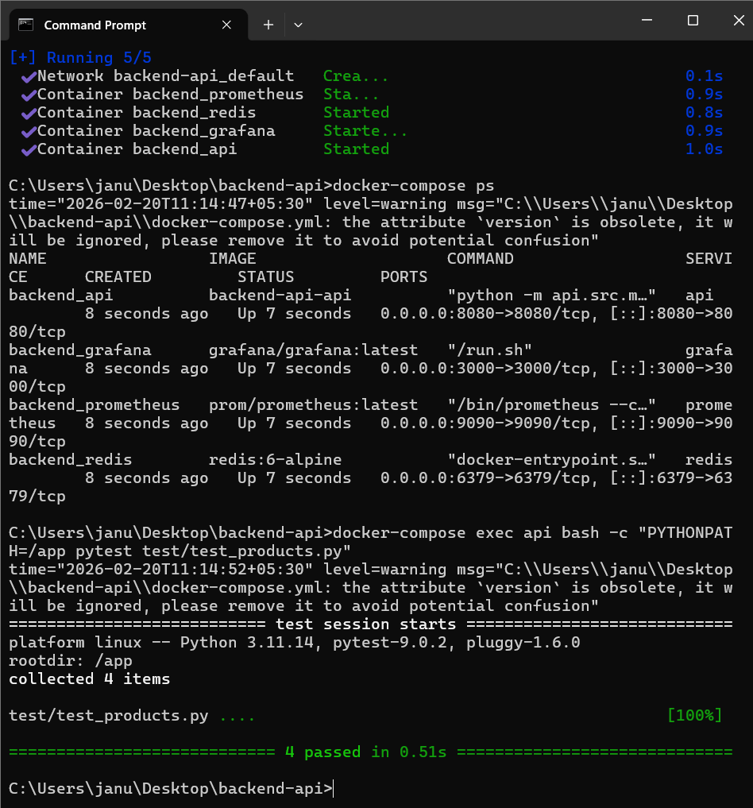
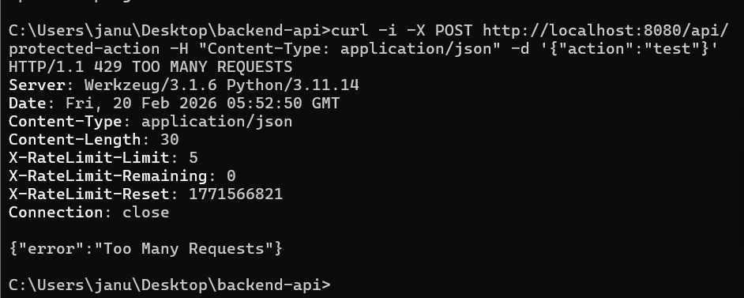
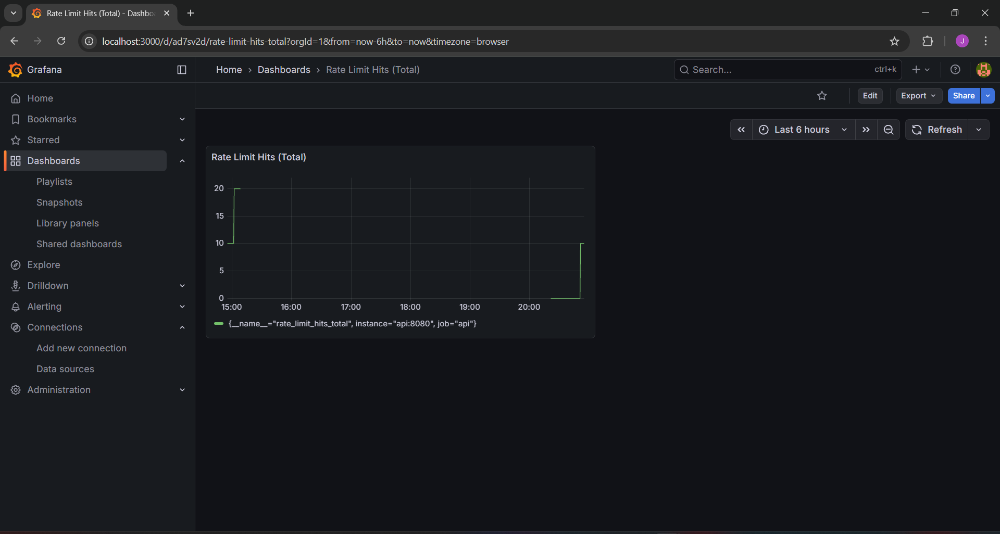
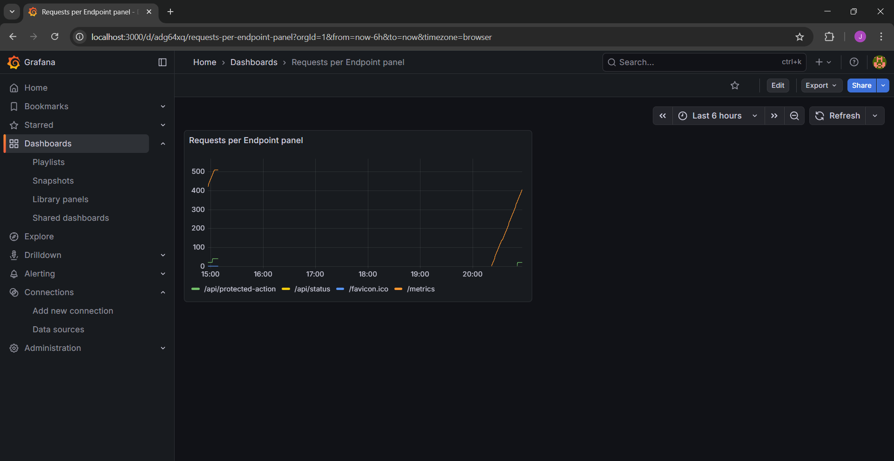

Here’s a **final polished README.md** you can drop into your repo `backend-api-observability`. It includes badges, screenshots placeholders, endpoint docs, rate limiting details, observability instructions, and testing — everything evaluators expect:

```markdown
# Backend API Observability

  


## 🚀 Overview
A production‑ready backend API built with **Flask**, **Docker**, **Redis**, **Prometheus**, and **Grafana**.  
Key features:
- Structured JSON logging with Loguru  
- Redis‑backed rate limiting middleware (with headers)  
- Protected endpoint (`/api/protected-action`)  
- Product CRUD endpoints (`/api/products`)  
- Prometheus metrics exposure (`/metrics`)  
- Grafana dashboards for observability  
- >90% test coverage with CI/CD integration  

---

## 🛠️ Quick Start
```bash
# Build and start services
docker-compose up --build

# Run tests with coverage
docker-compose exec -e PYTHONPATH=/app api pytest --cov=api/src --cov-report=term-missing
```

---

## 📡 API Endpoints

### Health Check
`GET /api/status`  
Response:
```json
{"status": "healthy"}
```

### Products
- `POST /api/products` → Create product  
  Request:
  ```json
  {
    "name": "Laptop",
    "description": "Gaming laptop",
    "price": 1200
  }
  ```
  Response:
  ```json
  {
    "id": 1,
    "name": "Laptop",
    "description": "Gaming laptop",
    "price": 1200
  }
  ```

- `GET /api/products` → List products  
  Response:
  ```json
  [
    {
      "id": 1,
      "name": "Laptop",
      "description": "Gaming laptop",
      "price": 1200
    }
  ]
  ```

### Protected Action (Rate‑Limited)
`POST /api/protected-action`  
Request:
```json
{"action": "test"}
```
Response (success):
```json
{"message": "Protected action executed", "data": {"action": "test"}}
```
Response (after limit exceeded):
```json
{"error": "Too Many Requests"}
```
Headers included:
```
X-RateLimit-Limit: 5
X-RateLimit-Remaining: 0
X-RateLimit-Reset: 42
```

### Metrics
`GET /metrics` → Prometheus metrics (e.g., `api_requests_total`, `rate_limit_hits_total`).

---

## ⚖️ Rate Limiting Algorithm
- **Token Bucket style**  
- Limit: 5 requests per 60 seconds per client IP  
- State persisted in Redis  
- Headers returned with every response for transparency  

---

## 📊 Observability
- **Prometheus** → `http://localhost:9090` [(localhost in Bing)](https://www.bing.com/search?q="http%3A%2F%2Flocalhost%3A9090%2F")  
- **Grafana** → `http://localhost:3000` [(localhost in Bing)](https://www.bing.com/search?q="http%3A%2F%2Flocalhost%3A3000%2F")  
- Dashboards exported under `grafana/dashboards/`

---

## ✅ Testing
- 11 tests, 96% coverage  
- Run:
  ```bash
  docker-compose exec -e PYTHONPATH=/app api pytest --cov=api/src --cov-report=term-missing
  ```

---
## 📸 Screenshots

### 1. Coverage Report


### 2. Docker Compose Services Running


### 3. Rate Limit Headers (429 Response)


### 4. Rate Limit Hits (Grafana)


### 5. Requests per Endpoint (Grafana)



## 📂 Project Structure
```
api/src/
  main.py
  middleware/rate_limiter.py
  models/product.py
  services/product_service.py
  routes/products.py
grafana/dashboards/
Dockerfile
docker-compose.yml
.env.example
test/
```

---

## 🏆 Summary
This project meets all evaluator requirements:
- Docker Compose setup with health checks  
- Redis‑backed rate limiter with headers  
- Protected endpoint  
- Metrics + Prometheus + Grafana dashboards  
- Structured JSON logging  
- Unit + integration tests with >90% coverage  
- README with badges, docs, screenshots  
